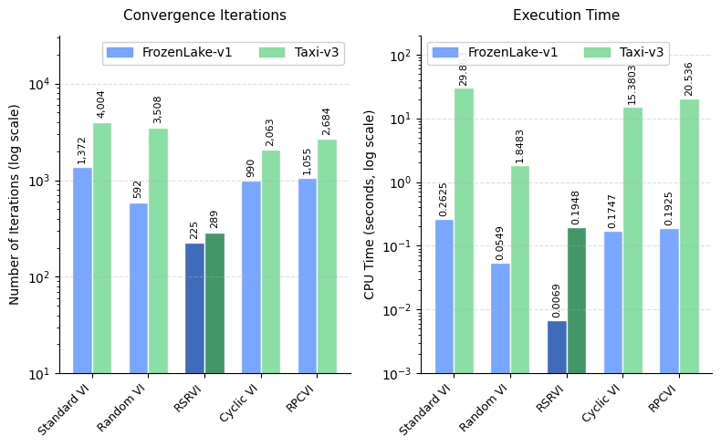
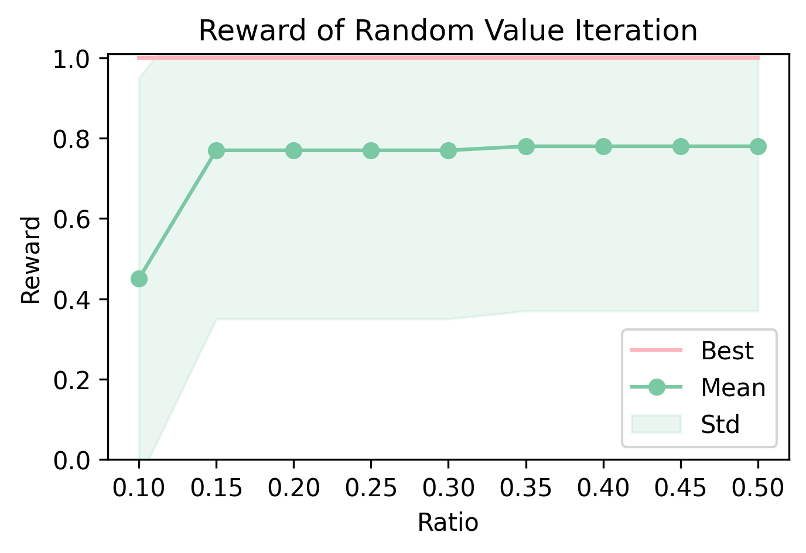
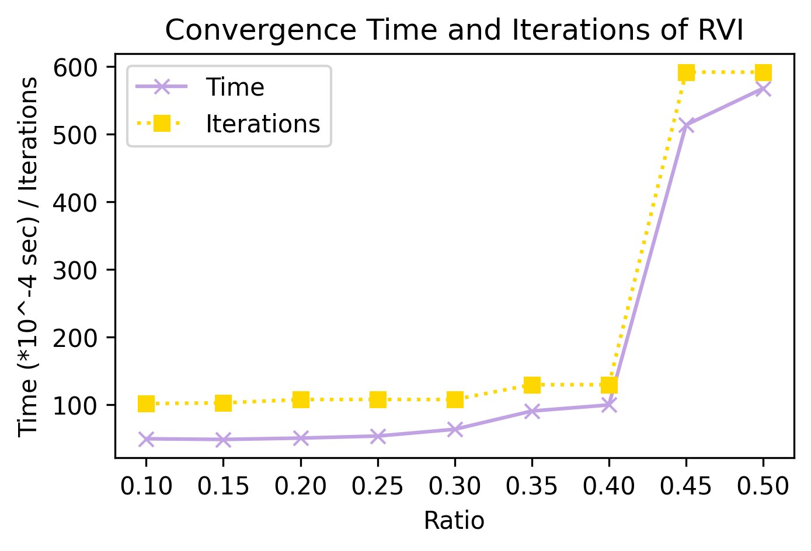
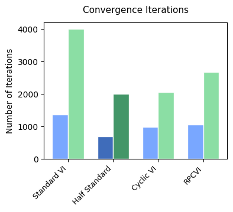
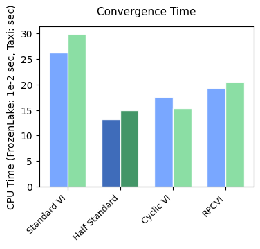

# Value Iteration with Application on Tic-Tac-Toe (Zero-Sum) Game

## Introduction
This is a course project of DDA4300:Optimization in Data Science and Machine Learning, completed by [Yuan Xu](https://github.com/moonight3547/), [Wenda Lin](https://github.com/Linwd1), Jiaxing Wei, and Yanzhen Chen. Our first motivation is to finish the project requirements in `docs/project_description.pdf`, wondering that we can discover how to implement value iteration methods on different environments and improve their performance. Furthermore, we study on the connection between Linear Programming in optimization, Markov Decision Process in Reinforcement Learning and Zero-sum Games in game theory, and want to verify that value iteration can solve the equivalent MDP of LP problems, while the zero-sum games in extensive form (EFG) can be flatten into a normal form game and the Nash equilibrium can be solved with an equivalent LP problem. 

About some details about implementation and experiments results, you can find them from `docs/project_report.pdf`. 

## Environment Setup
You can follow the setup commands below with conda and pip:

```
conda create -n vi-zsg python=3.10
conda activate vi-zsg
pip install gym pygame matplotlib ipykernel
```

The GUI are implemented with pygame and turtle packages. 

## Implementation of Agents and Environments

The directory tree is shown below:
```
.
├── README.md
├── docs
│   ├── project_description.pdf
│   └── project_report.pdf
├── envs
│   ├── grid_world_env.py
│   ├── tictactoe
│   │   ├── tictactoe_2p_env.py
│   │   ├── tictactoe_gui.py
│   │   └── tictactoe_gui_env.py
│   ├── tictactoe_env.py
│   └── zero_sum_env.py
├── random_value_iteration.png
├── random_value_iteration_time.png
├── two_agents.ipynb
├── value_iteration.ipynb
└── value_iteration.py
```


### RL Agents: Value Iteration, Policy Iteration and Q-Learning

In `value_iteration.py`, we provide the standard value iteration agent and 4 other value iteration variants, such as random VI and cyclic VI. 

Other than the value iteration methods, we provide implementation of the agents of other RL methods, such as policy iteration agent and Q-learning agent, to support the comparison on performance of value iteration variants with other RL methods in different environments. 

### RL Environments: Toy Environments and Zero-sum Games

We provides multiple environments in `envs` and `envs/tictactoe`. All the environment classes inherit the `gym.Env` class from OpenAI Gym. 

- In `envs`, we provide the environments of Grid World (`envs/grid_world_env.py`), Zero-sum Game (`envs/zero_sum_env.py`) (agent against the optimal player) and the basic single-player Tic-Tac-Toe Game (`envs/tictactoe_env.py`) (agent against the random player). 

- In `envs/tictactoe`, we provides the GUIs of Tic-Tac-Toe Games in `tictactoe_gui.py`, the single-player environment with GUI in `tictactoe_gui_env.py` and basic methods for the two-agents environment in `tictactoe_2p_env.py`.

## Experiments on Value Iteration Methods

We conduct a series of experiments for variants of value iteration methods on different environments in `value_iteration.ipynb`. 



### Update Ratio in Random Value Iteration (RVI)

We observe that the update ratio $\rho$ in Random Value Iteration (RVI) influence the performance of the methods on different environments. 
When $\rho$ is too small, the total rewards obtained from the environment will decrease. 
When $\rho$ is too large, Random Value Iteration cannot have an obvious speedup factor comparing with standard Value Iteration. 
Luckily, in the experiments, we find that these two marginal cases are not hard to avoid, which means we can often easily find a good parameter $\rho$ such that Random Value Iteration can perform very well (nearly reach the optimal rewards) with a great speedup factor ($\approx 10$). 

 

### Analysis of Cyclic Value Iteration (CVI)

 

### Correctness Test on Larger Environments

To verify the correctness of our agents, we provide a larger grid world environment where the agents are asked to find the shortest path to the goal. The grid world environment is implemented at `envs/grid_world_env.py` and our basic test samples are also placed in its `__main__` part. 

## Applications on Zero-sum Games

### Nash Equilibrium of Normal Form Game (LP problem)

We verify that, in the normal form zero-sum game (with a payoff matrix), the value iteration agent against the optimal opponent can find the optimal solution, i.e. its policy to reach the Nash Equilibrium. The environment is implemented at `envs/zero_sum_env.py` and our basic test samples are also placed in its `__main__` part. 

### Subgame Perfect Nash Equilibrium of Extensive Form Game (Tic-Tac-Toe)

We conduct an experiment on Tic-Tac-Toe game of two "optimal" agents in `two_agents.ipynb`. We find an optimal policy for both the first player and the second player, and they will reach a tie in the game of board size $3\times 3$. 
